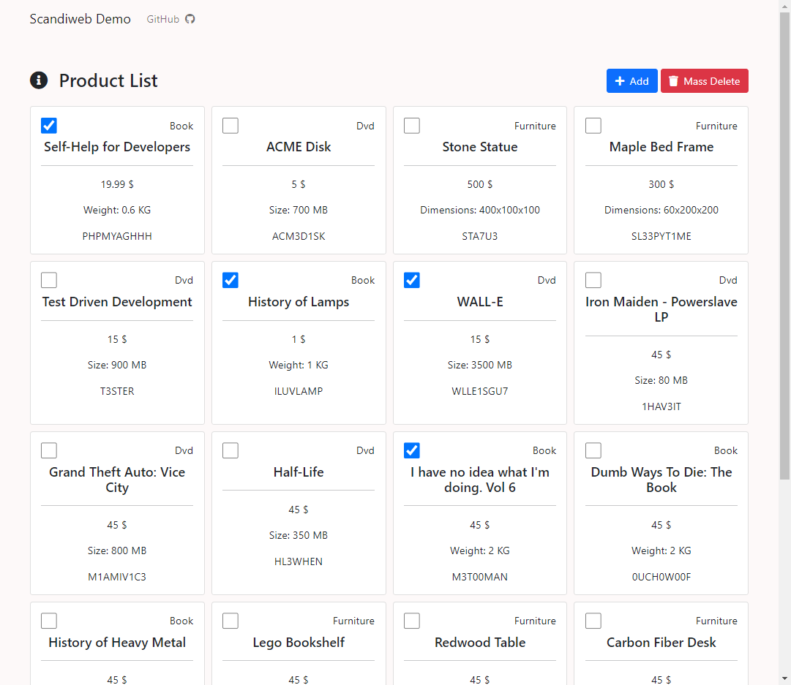
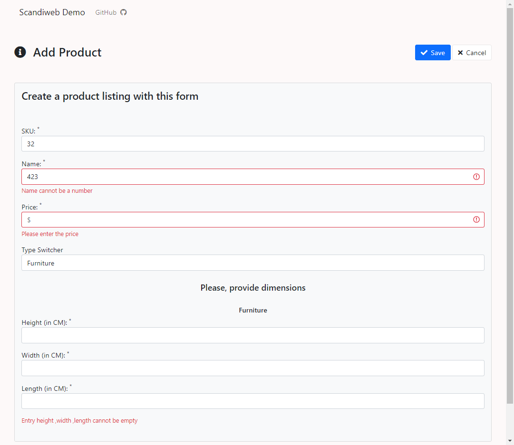

# Products Demo
A demo web app containing a page that lists products and ability to add/delete them

## Functionality
- View all Products
- Add Product
- Delete Product(s)

## Installation
- Download and install XAMPP https://www.apachefriends.org/download.html
- Import the contents into a folder in XAMPP/htdocs/<your_folder>
- Import the .sql found within the root folder into the database either via terminal or PhpMyAdmin http://localhost/phpmyadmin
- Turn on Apache and MySQL in XAMPP. The app is live at http://localhost/<your_folder>

## Live Demo
- https://drinky.alwaysdata.net/

## Screenshots

## License
[MIT](https://choosealicense.com/licenses/mit/)

